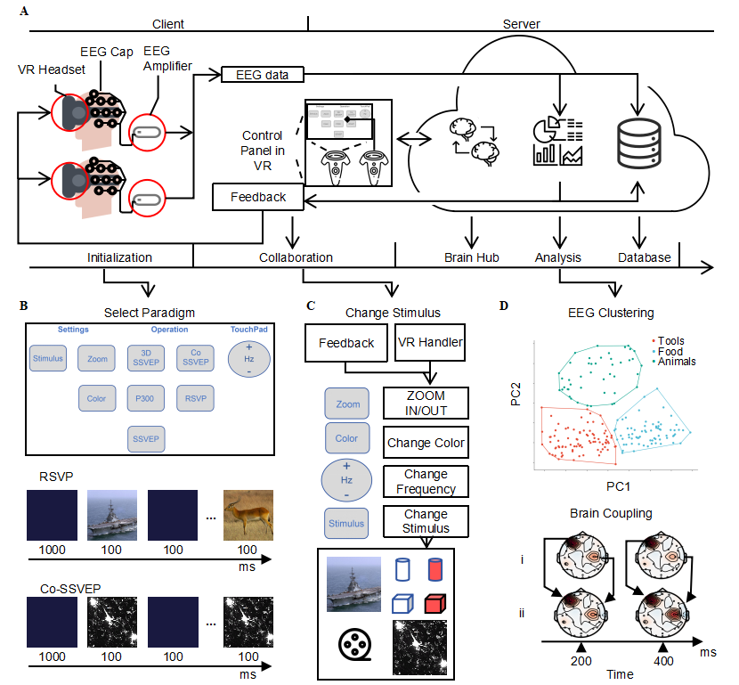

# **CVR-BBI Project**
**Welcome to the GitHub repository for the CVR-BBI project,** a state-of-the-art Collaborative Virtual Reality Brain-Brain Interface platform. This innovative project combines VR and BCI technologies to facilitate real-time brain-to-brain communication in a virtual environment.

## **Repository Structure**
This repository includes several key components organized as follows:

### **Code**
- **mysite:** The core Django server project which acts as the backbone of our application.
- **Global Routes and Configurations:** Central routing and configuration settings.
- **Database Management System (`bciDB`):** Handles all data storage concerns.
- **WebSocket Application (`chat`):** Ensures sustained long connections.
- **Data Analysis Tools (`data_analysis`):** Tools for offline data analysis.
- **Dataset Handling and Caching (`dataset`):** Manages data caching and dataset operations.

## **User Guide**
This section provides instructions for users who wish to use the CVR-BBI platform for its intended purposes without making modifications to the code.

### **Installation and Setup:** 
- **CVR-BBI Client:** 
Download and Setup CVR-BBI Client, Navigate to the application directory(CVR-BBI/release/CVR-BBI-V1.3.2/CAR_WS_VR_V1.3.2),Double-click the executable file(CAR_WS_VR.exe) and run the Application.
- **CVR-BBI Server:** 
Deploy the Server using Docker with the following commands on a Remote server with public IP:
```bash
# Load the Docker image from a tar file:
sudo docker load -i mysite_image.tar

# Run the Docker container and map port 8512 on the host to port 8000 inside the container:
sudo docker run -d -p 8512:8000 mysite
```

### **Basic Operations:** 
Specific operations require reference to CVR-BBI papers.

## **Developer Guide for Server**
### **Prerequisites**
- **Python** `3.11.3`
- **Django** `4.2.11`
- Other dependencies are listed in the `requirements.txt` file.

### **Installation Steps**
```bash
# Clone the repository:
git clone https://github.com/DILIU1/CVR-BBI.git

# Navigate to the project directory:
cd CVR-BBI/code

# Install the required packages:
pip install -r requirements.txt
```
### **Running the Application**

```bash
# Navigate to the 'mysite' directory:
cd ./code/mysite

# Run the Django server:
python manage.py runserver
```
## **Developer Guide for Client**
Navigate to the application directory(CVR-BBI/code/v3d_external),Configure according to the Vaa3D tutorial.
### **Prerequisites**
- **QT** `4.8.6`
- **OPENVR** ``
### **Contributing**

We warmly welcome contributions to the CVR-BBI project. For more information on how to contribute, please refer to our contributing guidelines.

### **License**

This project is licensed under the MIT License. 
Please note that this project uses various dependencies, each with its own licensing terms.see the [LICENSE](https://github.com/Vaa3D/Vaa3D_Wiki/wiki/LicenseAndAgreement.wiki) file for details.

### **Contact**
For any queries regarding the project, please feel free to contact us at di.liu@seu.edu.cn.